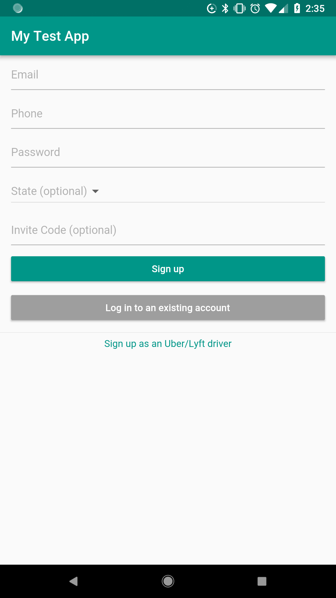

# `myapp`

A project to teach myself the [`Flutter`](https://flutter.io) mobile app framework.

## Running the project

Make sure you have enabled USB debugging on your Android device and that your device has been plugged into your development machine.

See https://developer.android.com/studio/debug/dev-options.html#enable for more information.

```sh
$ cd src
$ flutter run
```

## Screenshots

